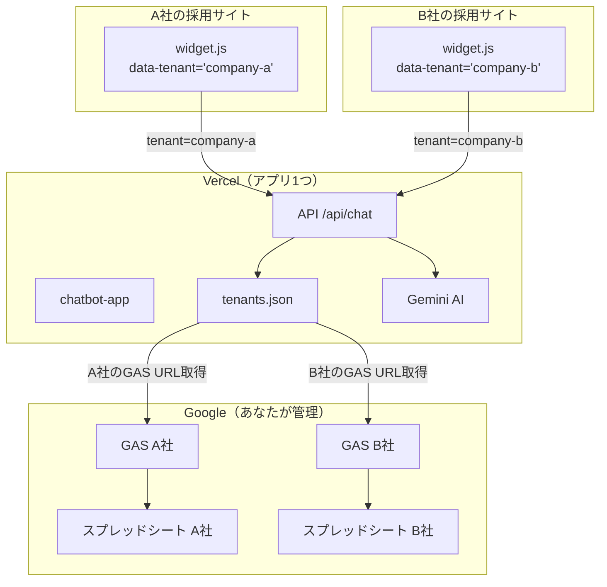
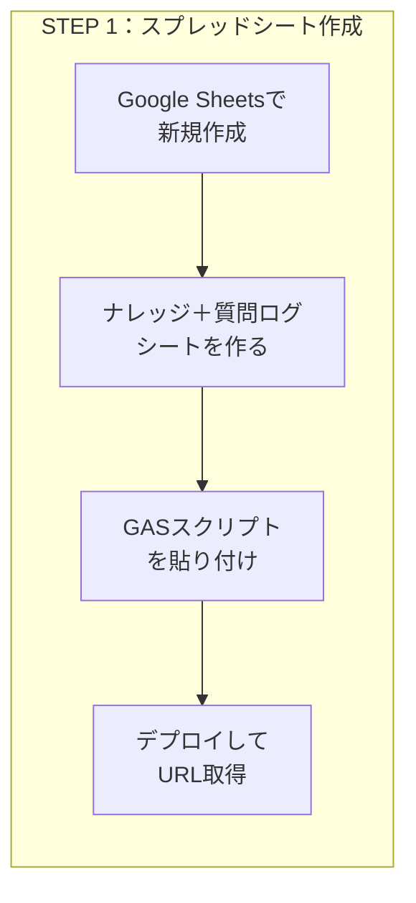
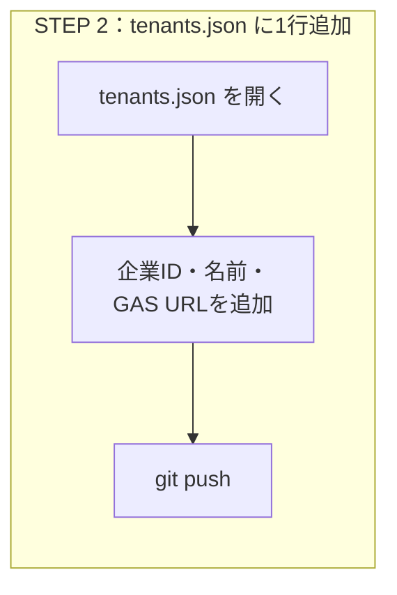
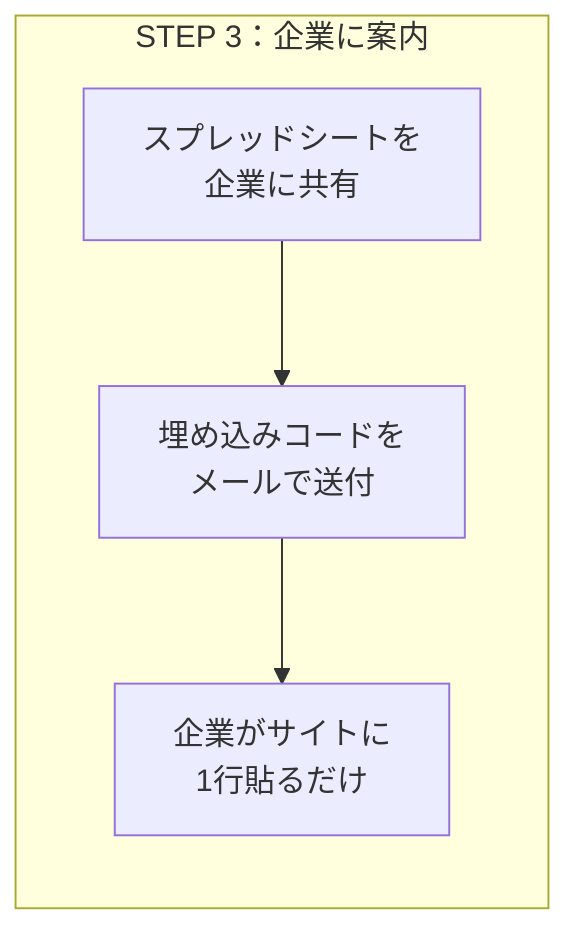

# マルチテナント構成ガイド

## 全体像



## 新しい企業を追加する流れ（3ステップ）







## 具体例：C社を追加する場合

### STEP 1. スプレッドシートを作る

あなたのGoogleドライブで新規スプレッドシートを作成し、GASを設定してURLを取得。

### STEP 2. tenants.json に追加

```json
{
  "demo": { ... },
  "company-c": {
    "name": "C社株式会社",
    "gasUrl": "https://script.google.com/macros/s/zzz/exec",
    "allowedOrigins": ["https://c-company.co.jp"],
    "blockedTopics": [],
    "customRules": []
  }
}
```

`git push` → Vercelが自動デプロイ（約30秒）

### STEP 3. 企業に案内メール

> C社ご担当者様
>
> チャットボットの準備が完了しました。
>
> ■ 企業情報の入力
> 共有したスプレッドシートの「ナレッジ」シートに御社の情報をご入力ください。
> 入力方法はこちら → https://your-app.vercel.app/setup
>
> ■ サイトへの設置
> 以下の1行を採用ページのHTMLに追加してください。
> ```
> <script src="https://your-app.vercel.app/widget.js" data-tenant="company-c"></script>
> ```

## 所要時間の目安

| 作業 | 時間 |
|------|------|
| スプレッドシート＋GAS作成 | 5分 |
| tenants.json追加＋デプロイ | 2分 |
| 企業への案内メール | 3分 |
| **合計** | **約10分/社** |
